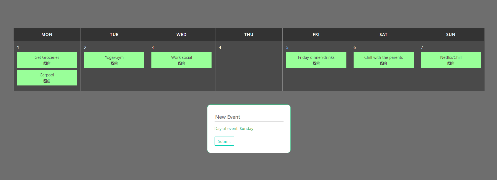

# calendar_app

## Project setup
```
npm install
```

### Compiles and hot-reloads for development
```
npm run serve
```

### Compiles and minifies for production
```
npm run build
```

### Lints and fixes files
```
npm run lint
```

### what you learn
1) Managing data between sibling component using Global event bus. How use props in components.
2) how to add use @click event
3) how to remove item from array using ES6


### Output




